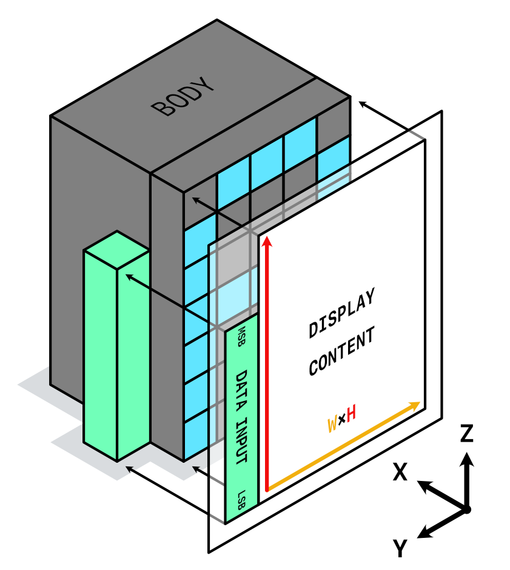

= Display [[disp]]

These modules display some input data to a player in the form of logic block activations.

Display modules all share a different layout from the standard layout. The differences include, but are not limited to:

* The inputs are vertical, and are placed at the left side of the display with their Least Significant Bit (LSB) at the bottom
* Outputs faces the player without mirroring
* Logic body grows toward the back (x+), instead of upward

[NOTE]
This layout is designed to allow connections to be easily wired from both the front and back sides. The additional width of the connection should not interfere with the layout, as these display panels are supposed to be tiled with one block in between.

== DISP ASCII [[disp_ascii]]

This module is a 5x7 ASCII display capable of showing alphanumeric characters (a-z, A-Z, 0-9) as well as special characters (!, @, #, +, etc.). The total supported ASCII ranges are listed as follows:

.ASCII Ranges
[%unbreakable]
[cols="1,1,1"]
|===
| ASCII | Character | Display

| 0x00-0x08 | *Other Control Characters* | *Undefined*
| 0x09 | Horizontal Tab | Blank
| 0x0A | *Other Control Character* | *Undefined*
| 0x0B | Vertical Tab | Blank
| 0x0C-0x1F | *Other Control Characters* | *Undefined*
| 0x20 | Spacebar | Blank
| 0x21-0x7E | Display Characters | Display Characters
|===

.Complexity Summary
[%unbreakable]
// TABLE: disp_ascii
