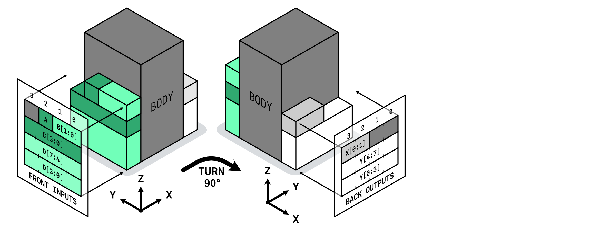

= SM Logic Modules !VERSION_TAG_HERE!: Datasheet
:doctype: book
:toc:
:toclevels: 4
:imagesoutdir: tmp/images/
:table-caption!:
:figure-caption!:

<<<

== About

The SM Logic Modules Project is located in the GitHub repository https://github.com/yliu-hashed/Scrap-Mechanic-EDA[]. The blueprint generation is done via https://github.com/yliu-hashed/Scrap-Mechanic-EDA[Scrap Mechanic EDA Project].

The SM-EDA Project aims to bring industry-level EDA tooling to players of the game Scrap Mechanic. The SM Logic Modules Project aids in this effort by providing prebuilt modules, as reusable pieces of advanced logic designs, to the community of Scrap Mechanic players, and empowering them to become future computer engineers, scientists, and logicians.

=== License

This document is licensed under https://creativecommons.org/licenses/by/4.0/[Creative Commons Attribution 4.0]. You must give attribution for using this document in other published works.

The generated blueprints are licensed under https://creativecommons.org/public-domain/cc0/[CC0]. You should have received them alongside this document. You can use the blueprints in whatever way you see fit, but attribution is strongly encouraged.

<<<

== Specifications

=== Module Specifications

==== Port Location

All modules are generated with the input plane in the front and the output in the back. Both planes are usually ordered in an alphabetical *top-down* order. Bits may also be placed in such a way that saves space. Bits in the input plane are ordered such that the Least Significant Bit (LSB) is at the bottom right, and the Most Significant Bit (MSB) is at the top left (when viewed from the front direction). This layout is the natural arithmetic order.

Bits in the output plane use a world-coordinate *translated* order of the front input ports. This makes connecting modules easier. If two modules are placed one after another, the connections from one port to the next port will be made of only parallel lines. But this arrangement makes the output plane look as if it were mirrored.

[CAUTION]
The port's location in the datasheet below accounts for this mirroring. They are displayed in a way that shows the bits when you *look at* each port surface. But notice that the bit order is reversed.

==== Color

Generally, *inputs are green* and *outputs are white* for large and unambiguous buses. If more than one input or output buses exist, each bus alternates between shades. Special ports are color-coded to avoid misidentification. Different modules may have their distinct coding, but some codes are identical across all modules.

* *Blue*: Global clock signal
* *Green*: (in output) the `DONE` signal for sequential modules
* *White*: (in input) the `START` signal for sequential modules
* *Yellow & Red*: various carry, overflow, or otherwise caution signals

<<<

=== Timing Specification

==== Combinational

[wavedrom,,svg,scale=75%]
....
{ signal: [
  {name: 'IN' , wave: 'x7....x.', data: ['valid data'], node: '.A'},
  {node: '.I..O..'},
  {name: 'OUT', wave: 'x...2.x.', data: ['old data', 'new data'], node: '....B'},
], edge: [
  'I-A',
  'O-B',
  'I+O Tpd',
], config:{ marks:false }}
....

Combinational modules have no latches and flip-flops in them, or behave like they don't. The output is undefined after the moment any input changes. An input value has to hold for *T~pd~* long for a valid output value to appear.

.Value Keys
* *T~pd~* = propagation delay
+
This property refers to the longest number of connections from any input port to any output port. This is the critical depth.

* *T~pdi~(P)* = input propagation delay (setup time) for a specific port
+
This property refers to the longest number of connections from an input port *P* to any global output.

* *T~pdo~(P)* = output propagation delay for a specific port
+
This property refers to the longest number of connections from any global input to a global output port *P*.

[TIP]
If any number of combinational modules are connected in a chain. The critical depth can be estimated by adding their *T~pd~* together.

<<<

==== Sequential

[wavedrom,,svg,scale=75%]
....
{ signal: [
  {name: 'CLK', wave: 'l...H...'},
  {node: '.I..C.O..'},
  {name: 'IN' , wave: 'x7..x...', data: ['valid data'], node: '.A'},
  {name: 'OUT', wave: '2...x.2.', data: ['old data', 'new data'], node: '......B'},
], edge: [
  'I-A',
  'O-B',
  'I+C Tpdi',
  'C+O Tpdo'
], config:{ marks:false }}
....

.Value Keys
* *T~pd~* = propagation delay
+
This property refers to the longest number of connections between any input/FF-out and any output/FF-in. This is the critical depth and is the minimum clock duration.

* *T~pdi~(P)* = input propagation delay (or setup time) for a specific port
+
This property refers to the longest number of connections from an input port *P* to any global output or flip-flop input.

* *T~pdi~* = input propagation delay (or setup time)
+
This property refers to the longest number of connections from any global input to any global output or flip-flop input.

* *T~pdo~(P)* = output propagation delay for a specific port
+
This property refers to the longest number of connections from any global input or flip-flop output to a global output port *P*.

* *T~pdo~* = output propagation delay
+
This property refers to the longest number of connections from any global input or flip-flop output to any global output.

Sequential modules are synchronized with a clock input. An input should be set up for *T~pdi~* before a rising clock edge. An input does not need to hold after a rising edge. An output will be valid after *T~pdo~* of delay. Any clock duration faster than *T~pd~* may result in a critical depth error, where the behavior of the circuit can no longer be defined.

[TIP]
If two sequential modules are connected, and there is no pure combinational logic in both modules, the critical depth is max(*T~pd1~*, *T~pd2~*, *T~pd1~(out~1~)*+*T~pdi1~(in~2~)*).

<<<

:sectnums:
:sectnumlevels: 3

include::add.adoc[]

include::mul.adoc[]

include::sqr.adoc[]

include::div.adoc[]

include::rem.adoc[]

include::sqrt.adoc[]

include::misc.adoc[]

include::bcd_conv.adoc[]

include::mem.adoc[]

include::table.adoc[]
